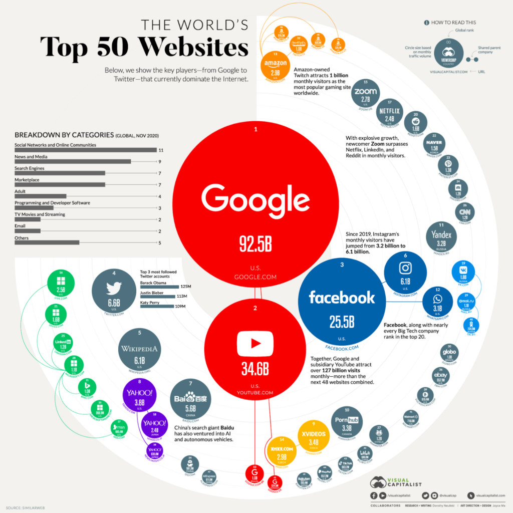
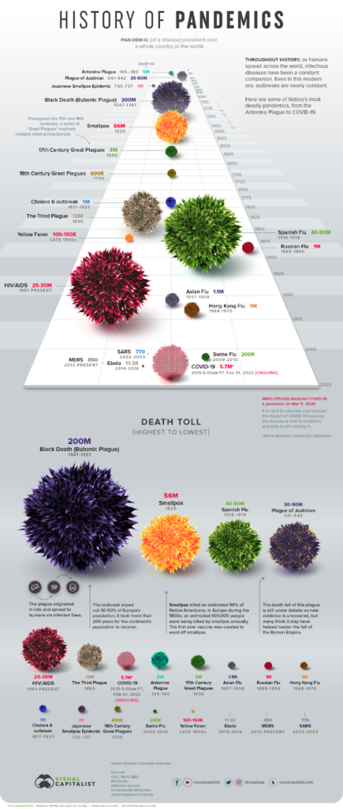
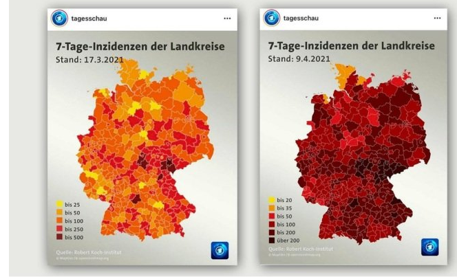
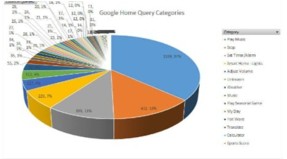

-  Nama : Kemas Veriandra Ramadhan
-  NIM  : 122450016
-  Kelas: RA

# Visualisasi Baik

1. Keaslian Data:
- Sumber Data: Gambar menyebutkan bahwa data diambil dari SimilarWeb. SimilarWeb adalah sumber yang dapat dipercaya untuk data tentang trafik web dan analisis situs, sehingga kita bisa mengatakan bahwa data ini memiliki tingkat keaslian yang tinggi.
- Kategori Waktu: Gambar merujuk pada data global November 2020, yang menegaskan bahwa data ini merupakan snapshot dari trafik bulanan selama periode waktu tertentu.
- Pengukuran Trafik: Angka-angka seperti 92,5B untuk Google dan 34,6B untuk YouTube menunjukkan jumlah trafik bulanan yang sangat besar. Ini merupakan metrik yang sering digunakan untuk mengukur popularitas situs web berdasarkan kunjungan pengguna unik per bulan.
  
2. Kemudahan User Membaca:
- Hierarki Visual: Gambar menggunakan lingkaran dengan ukuran yang berbeda-beda untuk menunjukkan skala trafik dari setiap situs. Google yang paling besar dengan 92,5 miliar pengunjung bulanannya, diikuti oleh YouTube, Facebook, dan situs-situs lain dengan ukuran lingkaran yang lebih kecil. Ini membantu pengguna untuk dengan cepat mengidentifikasi situs-situs teratas.
- Tata Letak: Situs diorganisasikan dengan sangat baik berdasarkan trafik dan kategori yang sesuai. Ada pemisahan antara kategori situs di sisi kiri yang membantu pengguna memahami kelompok-kelompok situs ini (misalnya: Social Networks, Search Engines, Marketplace).
Simbol dan Warna: Penggunaan warna dan ikon yang berbeda (misalnya, warna merah terang untuk Google dan YouTube, biru untuk Facebook, hijau untuk situs dari negara Asia) membantu dalam identifikasi cepat dan navigasi visual.

3. Fungsi Setiap Elemen:
- Lingkaran Utama: Lingkaran-lingkaran dengan ukuran yang berbeda menunjukkan jumlah trafik bulanan dari masing-masing situs, di mana lingkaran yang lebih besar menunjukkan trafik yang lebih tinggi. Ini adalah elemen utama dari visualisasi.
- Label Angka: Setiap lingkaran diberi label dengan jumlah trafik unik bulanan yang menunjukkan skala popularitas situs tersebut.
- Kategori Situs: Di bagian kiri gambar, kategori-kategori situs ditampilkan (seperti Social Networks, Search Engines, Marketplace, dll.), memberikan gambaran luas tentang bagaimana situs-situs ini dikelompokkan dan peran mereka di internet.
- Ikon Sosial Media: Pada beberapa situs seperti Twitter dan Instagram, terdapat ikon dan informasi tambahan yang memberikan konteks tentang seberapa besar platform tersebut diukur dari metrik lain (seperti jumlah follower teratas di Twitter).
- Warna dan Pola: Warna dan pola visual pada lingkaran (gradasi atau solid) membantu pengguna membedakan antara situs-situs dari berbagai kategori atau negara.
4. Kemenarikan Visualisasi:
- Desain Estetis: Penggunaan warna yang cerah, kontras, dan elemen grafis yang sederhana tetapi efektif membuat visualisasi ini menarik secara estetika. Pemilihan warna yang berbeda-beda untuk setiap kategori situs juga membuatnya lebih mudah untuk dibaca dan dipahami.
- Struktur Sirkular: Penggunaan struktur sirkular untuk mewakili situs dengan trafik tertinggi memberikan tampilan yang dinamis dan tidak monoton. Pengguna dapat dengan mudah melacak ukuran lingkaran terbesar ke yang lebih kecil dengan mengikuti arah dari pusat lingkaran.
- Detail Menarik: Ada tambahan informasi yang membuat visualisasi lebih interaktif, seperti fakta tentang situs tertentu (misalnya, tentang Twitch dan Facebook) yang memberi wawasan tambahan di luar hanya jumlah trafik.

1. Keaslian Data:
- Sumber Data: Data tersebut tampaknya mengacu pada beberapa sumber historis, termasuk perkiraan jumlah kematian dari WHO dan sumber sejarah lainnya. Meski beberapa data, seperti jumlah kematian dari pandemi kuno, merupakan perkiraan, ini merupakan cara umum dalam menyajikan data pandemik yang tidak selalu terdokumentasi dengan baik.
- Validitas: Mengingat sumber dan standar reputasi Visual Capitalist, serta referensi mereka ke WHO, data ini dapat dianggap valid untuk digunakan dalam konteks edukasi.
2. Kemudahan User Membaca:
- Ukuran dan Tata Letak: Gambar ini menggunakan bola 3D berwarna dengan ukuran yang berbeda-beda untuk memvisualisasikan jumlah kematian yang diakibatkan oleh berbagai pandemi. Ukuran yang lebih besar mewakili pandemi dengan angka kematian yang lebih tinggi, seperti Black Death (Bubonic Plague), sementara yang lebih kecil mewakili pandemi dengan kematian lebih sedikit.
- Label yang Jelas: Setiap bola diberi label dengan nama pandemik dan jumlah kematian, yang memudahkan pengguna untuk melihat perbandingan secara langsung antara berbagai pandemi.
- Waktu Kronologis: Pandemik diatur secara kronologis dari atas ke bawah, memudahkan pengguna untuk mengikuti perkembangan sejarah dari pandemi yang lebih tua hingga yang lebih baru, termasuk COVID-19.
3. Fungsi Setiap Elemen:
- Bola 3D: Setiap bola atau lingkaran berfungsi untuk mewakili jumlah korban jiwa akibat setiap pandemi, dengan warna yang berbeda dan ukuran bola menunjukkan skala keparahannya. Ini adalah elemen visual utama yang digunakan untuk mengkomunikasikan dampak setiap pandemi.
- Timeline: Pandemik diurutkan berdasarkan waktu kejadian, dengan pandemi yang lebih tua berada di atas dan pandemi modern di bagian bawah. Ini membantu pengguna melihat sejarah dan evolusi dari penyakit-penyakit menular ini secara kronologis.
- Teks Penjelasan: Di sepanjang visual, ada penjelasan singkat yang menggambarkan detail penting dari pandemi tertentu, seperti asal-usul penyakit, cara penyebaran, dan dampaknya terhadap populasi dunia.
- Skala Kematian: Pada bagian bawah, ada urutan visualisasi berdasarkan jumlah korban, dari yang tertinggi (Black Death dengan 200 juta kematian) hingga yang terendah (COVID-19 dengan 5,7 juta hingga saat ini, data November 2020).
4. Kemenarikan Visualisasi:
- Desain 3D: Penggunaan desain bola 3D yang menyerupai representasi visual virus atau patogen membuatnya sangat menarik secara visual. Ini tidak hanya memberikan visualisasi yang mencolok, tetapi juga menyiratkan bentuk dan sifat berbahaya dari virus atau bakteri penyebab pandemi.
- Kontras Warna: Warna-warna yang cerah dan kontras seperti merah, kuning, dan hijau tidak hanya memudahkan identifikasi visual, tetapi juga menciptakan daya tarik yang kuat bagi mata pengguna, terutama dalam membandingkan pandemi dengan cepat.
- Visual yang Dinamis: Tampilan yang dinamis dengan efek kedalaman membuat pengguna lebih tertarik untuk mempelajari sejarah dan dampak setiap pandemi. Ini juga memberikan sensasi betapa besarnya dampak dari pandemi tersebut melalui representasi visual yang ekspresif.
- Infografik yang Interaktif: Selain bola 3D, ada fakta-fakta menarik yang tertulis di sekitar gambar, memberikan konteks tambahan tentang setiap pandemi tanpa membuatnya terlihat terlalu penuh.

Visualisasi dalam gambar tersebut bisa dikatakan kurang baik atau “bad visualization” dengan mempertimbangkan empat aspek berikut:

# Visualisasi Buruk

1. Keaslian Data
- Masalah: Tidak ada informasi yang jelas mengenai skala atau jumlah kasus yang sesungguhnya, hanya diberikan kategori warna berdasarkan rentang insiden 7 hari.
- Penjelasan: Warna yang terlalu cerah atau terlalu gelap dapat membuat pembaca kesulitan membedakan tingkatan insiden pada wilayah tertentu, sehingga menyebabkan interpretasi yang salah. Jika data yang mendasarinya tidak diwakili secara tepat oleh warna, keaslian data bisa diragukan.
2. Kemudahan User Membaca
- Masalah: Terdapat beberapa warna yang mirip satu sama lain, seperti merah tua dan merah marun. Ini membuat perbedaan kategori pada peta sulit dikenali oleh pembaca secara cepat.
- Penjelasan: Warna merah dalam beberapa tingkatan hampir tidak dapat dibedakan, yang menyulitkan pembaca dalam memahami perbedaan jumlah insiden secara visual. Semakin serupa warnanya, semakin sulit user mengidentifikasi perbedaannya, terutama di peta dengan begitu banyak area yang saling berdekatan.
3. Fungsi Setiap Elemen
- Masalah: Penggunaan warna yang sangat gelap pada visualisasi (merah tua hingga hitam) di peta sebelah kanan bisa menimbulkan kesan bahwa semua daerah memiliki insiden yang sangat tinggi, bahkan jika perbedaannya kecil.
- Penjelasan: Skala warna perlu digunakan dengan proporsi yang seimbang, sehingga elemen visual (warna) mencerminkan dengan akurat perbedaan insiden antar wilayah. Di sini, warna yang sangat intens pada peta kanan bisa menyebabkan overinterpretation.
4. Kemenarikan Visualisasi
- Masalah: Walaupun visualisasi menggunakan warna-warna yang mencolok, hal ini tidak secara langsung membuatnya menarik. Sebaliknya, peta terlihat ‘berat’ dengan warna merah gelap mendominasi, yang mungkin membuat visualisasi tampak menakutkan dan sulit untuk dianalisis secara objektif.
- Penjelasan: Visualisasi yang menarik seharusnya memberikan keseimbangan antara estetika dan fungsi. Penggunaan gradasi warna yang lebih halus dan pilihan palet yang lebih netral mungkin akan lebih efektif dalam membantu user memahami data tanpa terbawa kesan emosional yang kuat.

1. Keaslian Data
- Masalah: Pie chart sering kali tidak efektif untuk menunjukkan perbedaan antar kategori jika jumlah kategorinya banyak. Dalam visualisasi ini, ada banyak segmen kecil yang sulit dibedakan, membuat presentasi data menjadi tidak akurat atau terkesan tidak memberikan gambaran yang utuh.
- Penjelasan: Data mungkin akurat, tetapi cara penyajiannya dengan pie chart tidak ideal untuk membandingkan kategori yang jumlahnya kecil. Angka yang sangat kecil terlihat sepele dan tidak jelas skalanya, sehingga berpotensi menyesatkan interpretasi.
2. Kemudahan User Membaca
- Masalah: Banyaknya segmen kecil dengan warna yang hampir sama atau sulit dibedakan, serta banyaknya teks yang bertumpuk, membuat visualisasi ini sangat sulit dibaca. Kategori kecil seperti “Hot Word” dan “Sports Score” hampir tidak terlihat atau tidak signifikan dibanding kategori lain yang lebih besar.
- Penjelasan: Pie chart yang memiliki terlalu banyak kategori membuat pembaca kesulitan untuk memahami perbedaan secara cepat. Label yang terlalu padat juga menyebabkan visualisasi menjadi kacau dan sulit dibaca, terutama jika diagram dilihat dalam ukuran yang lebih kecil.
3. Fungsi Setiap Elemen
- Masalah: Pie chart tidak memberikan perbandingan yang jelas antara kategori karena perbedaan ukuran segmen menjadi sulit diukur secara visual, terutama ketika ada segmen yang sangat besar dibandingkan yang lain.
- Penjelasan: Pie chart dengan segmen yang terlalu kecil dan padat cenderung membuat data lebih sulit untuk dianalisis. Penggunaan diagram batang atau diagram lain yang lebih linear akan lebih membantu dalam membandingkan jumlah tiap kategori.
4. Kemenarikan Visualisasi
- Masalah: Visualisasi ini menggunakan terlalu banyak warna yang berbeda-beda tanpa gradasi yang jelas, membuat tampilan visualisasi menjadi tidak teratur dan kurang menarik.
- Penjelasan: Visualisasi yang menarik harusnya memberikan keseimbangan antara estetika dan fungsi. Penggunaan palet warna yang lebih sederhana dan desain yang lebih bersih akan membuat visualisasi ini lebih menarik dan informatif.